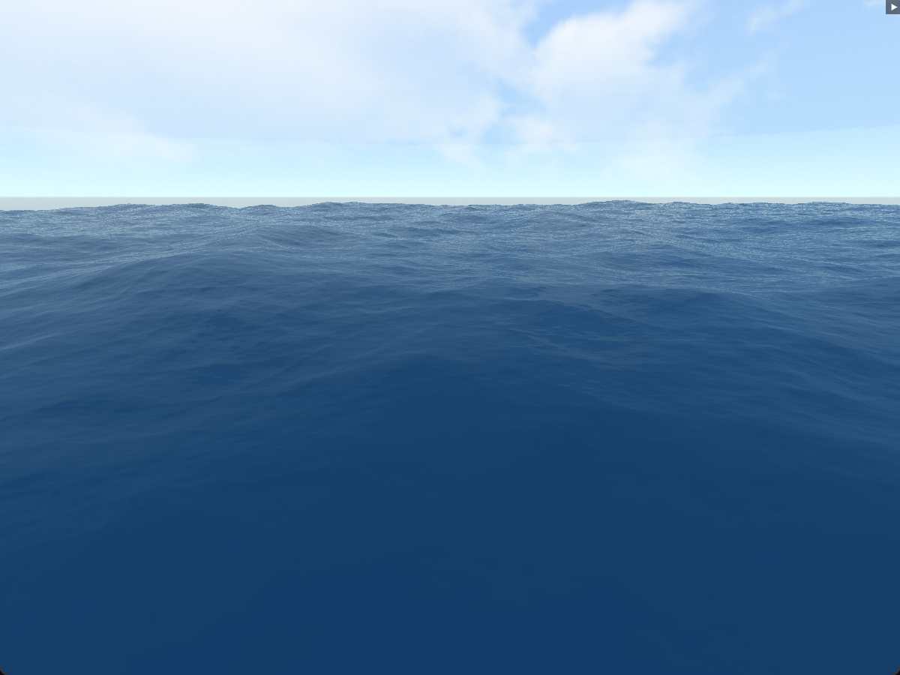

# wave1: A Sum-of-Sines Ocean Simulation

## Overview
*wave1* is the final project in my journey of learning OpenGL, before I felt comfortable enough with graphics programming to move onto a modern API. Therefore, performance, code maintainability and readability were not my primary focus, as I instead sought a visually appealing and convincing ocean simulation.

While sum-of-sines isn't a accurate model of ocean movement, I still tried to make the simulation as realistic as possible. For example, some of the design choices I implemented to improve realism were:
- calculating exact vertex normals by deriving the partial derivative of the wave with respect to x and z, instead of using an approximation like central difference,
- adding domain warping to achieve natural wave movement (waves will slightly "push" each other around),
- using image-based sky reflections to achieve a more realistic water lighting model, and
- accounting for the Fresnel Effect regarding water surface reflections.

## Design
Most of the code is located within the `wave1/main.cpp` file. The code within this file initializes external libraries, creates the window, sets up callback functions, allocates and initializes GPU memory, and finally executes the infinite render loop.

The code within the `wave1/wave.hpp` file is used to dynamically create the ocean mesh, a flat sheet of vertices along the xz-plane. 

The code within the `wave1/camera.hpp` file is used to create the fly camera, which allows the user to reposition their view within the scene. The camera can be rotated by holding down, then moving, the right mouse button.

The code within the `wave1/wave.vert` and `wave/wave.frag` files are the vertex and fragment shader for the wave mesh, respectively.

## Sources
I used Chapter 1 of Nvidia's [GPU Gems](https://developer.nvidia.com/gpugems/gpugems/part-i-natural-effects/chapter-1-effective-water-simulation-physical-models) and Acerola's [How Games Fake Water](https://www.youtube.com/watch?v=PH9q0HNBjT4) as my main sources of inspiration and aid throughout the project.

Some code snippets are taken from [Learn OpenGL](https://learnopengl.com/). 

## Dependencies
- OpenGL: Graphics API
- GLFW: Window Creation and I/O Handling
- GLAD: OpenGL Ease-of-use
- GLM: Math Library
- stb_image: Texture Handling
- ImGui: UI
